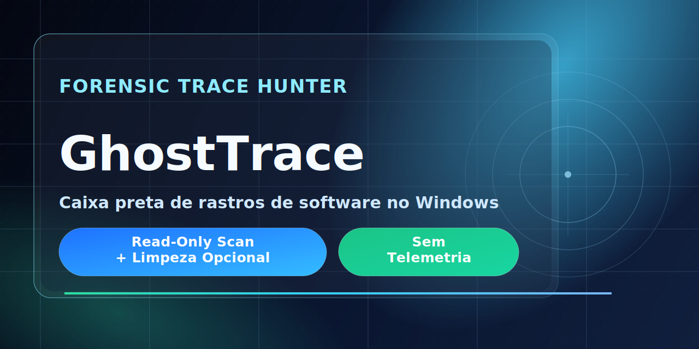
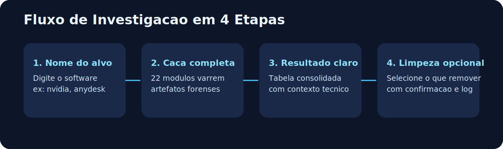
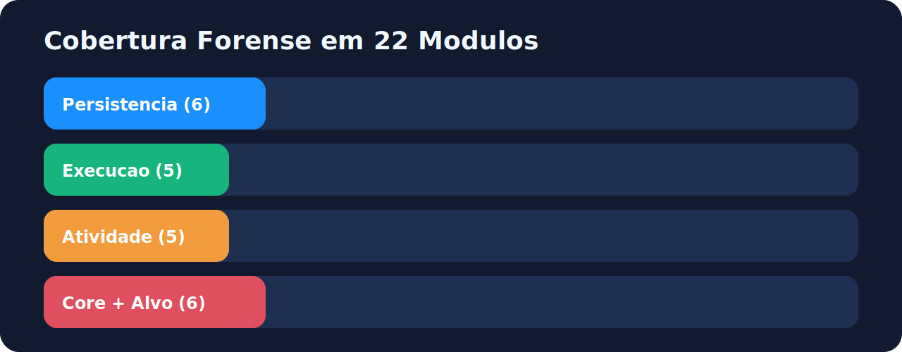

# GhostTrace



**Investigacao local de rastros de software no Windows, com coleta forense, relatorios auditaveis e limpeza estritamente opt-in.**

[Primeiros passos](#primeiros-passos) | [Capacidades](#capacidades) | [Seguranca](#seguranca-forense) | [Documentacao](#documentacao) | [Roadmap](docs/roadmap.md)

[](../../releases/latest)


---

GhostTrace ajuda analistas e administradores a responder uma pergunta simples: **o que ainda ficou no sistema depois que um software foi removido?**

Em uma unica execucao, a ferramenta coleta evidencia de persistencia, execucao, atividade de usuario e artefatos do sistema. Ela apresenta os achados por modulo, permite exportar registros locais e so oferece remocao para candidatos com regras de confianca restritas.

> GhostTrace nao classifica um achado como prova conclusiva de comprometimento. Ele preserva e organiza evidencia para a sua analise.

## Primeiros passos

### 1. Instale

Baixe o instalador mais recente em [Releases](../../releases/latest):

```text
GhostTrace-<version>-x64.msi
```

O pacote e **self-contained**, portanto nao requer a instalacao previa do runtime .NET na maquina alvo. O GhostTrace deve ser executado como administrador para coletar artefatos protegidos do Windows.

### 2. Investigue um nome

```powershell
GhostTrace.CLI scan --name nvidia
```

O modo interativo exibe o progresso, consolida os achados e permite exportar o relatorio. Quando existirem residuos elegiveis, a limpeza e opcional e exige selecao explicita seguida de confirmacao textual.

### 3. Automatize uma coleta

```powershell
GhostTrace.CLI scan --name nvidia --quiet --output C:\Cases\Host1
```

O modo `--quiet` nao abre prompts e grava o relatorio TXT no diretorio indicado. Se o relatorio nao puder ser persistido, o comando retorna um codigo de erro.

### Comandos principais

| Objetivo | Comando |
| --- | --- |
| Abrir o menu interativo | `GhostTrace.CLI` |
| Fazer triagem sem filtro | `GhostTrace.CLI scan` |
| Procurar rastros de um software | `GhostTrace.CLI scan --name <nome>` |
| Coletar para automacao | `GhostTrace.CLI scan --name <nome> --quiet --output <diretorio>` |
| Correlacionar tarefas COM e TaskCache | `GhostTrace.CLI scan-tasks-correlate-json --output <arquivo.json>` |
| Coletar diretorio, Registro ou Event Log | `scan-fs-json`, `scan-reg-json`, `scan-evt-json` |

Para definir outro idioma da interface, passe `--lang` antes ou depois do comando:

```powershell
GhostTrace.CLI scan --name nvidia --lang en
GhostTrace.CLI --lang es
```

## O que a coleta entrega



1. Executa os modulos forenses disponiveis para o tipo de coleta escolhido.
2. Mantem findings, erros e metadados separados por modulo.
3. Exibe um resumo local e permite exportar um registro de texto ou JSON nos comandos direcionados.
4. Opcionalmente registra qualquer acao de limpeza em um log separado.



## Capacidades

| Area | Evidencia coletada |
| --- | --- |
| Persistencia | Run/RunOnce, Startup, servicos, Winlogon, IFEO, AppInit, LSA, Active Setup, WMI e tarefas agendadas |
| Execucao | Prefetch, Shimcache, BAM/DAM, UserAssist e MUICache |
| Atividade | Historico PowerShell, RDP, RecentDocs, USB e redes conhecidas |
| Sistema e instalacao | Entradas de uninstall, StartupApproved e residuos em Program Files, ProgramData e AppData |
| Correlacao | Divergencias entre Task Scheduler COM e TaskCache para investigacao de Ghost Tasks (T1053.005) |

### Modulos de persistencia

| Modulo | Tecnica ou fonte |
| --- | --- |
| `PersistenceScanModule` | Run/RunOnce e pastas Startup |
| `ServicesScanModule` | Servicos e drivers com `ImagePath` |
| `AsepScanModule` | Winlogon, IFEO, AppInit, LSA e Active Setup |
| `ScheduledTasksScanModule` | Task Scheduler COM, incluindo tarefas ocultas |
| `TaskCacheScanModule` | `TaskCache\Tree` e anomalias de tarefas |
| `WmiPersistenceScanModule` | `__EventFilter`, `__EventConsumer` e bindings |

### Modulos de execucao e atividade

| Modulo | Fonte |
| --- | --- |
| `PrefetchScanModule` | Arquivos `.pf` Windows 10/11, incluindo XPRESS-Huffman |
| `ShimcacheScanModule` | AppCompatCache |
| `BamScanModule` | BAM/DAM por SID |
| `UserAssistScanModule` | Execucoes GUI e contagens de uso |
| `MuiCacheScanModule` | MUICache do shell |
| `PowerShellHistoryScanModule` | PSReadLine e sinais de comandos suspeitos |
| `RdpConnectionScanModule` | Historico de conexoes RDP de saida |
| `RecentDocsScanModule` | RecentDocs do Explorer |
| `UsbDeviceScanModule` | Historico USBSTOR |
| `NetworkArtifactsScanModule` | Hosts e perfis de rede |

## Seguranca forense

O comportamento padrao do GhostTrace e **somente leitura**. A limpeza existe para residuos de software, nao para remediacao automatica de malware.

- A coleta nao transmite dados e nao depende de servicos cloud.
- A limpeza nunca e preselecionada: exige escolha manual e uma palavra de confirmacao.
- Caches de execucao e historicos permanecem fora da limpeza para preservar evidencia.
- Diretorios so podem ser removidos se forem filhos diretos de roots confiaveis, se seu nome corresponder exatamente ao alvo e se nao forem junctions ou symlinks.
- Correspondencias parciais viram `FilesystemTraceHint`: aparecem no relatorio, mas nao sao candidatas a remocao.
- Relatorios JSON sao gravados atomicamente; um arquivo existente so e substituido depois que a nova escrita termina.
- `Ctrl+C` cancela cooperativamente a correlacao de tarefas e a leitura de Prefetch.

## Saidas e interpretacao

| Saida | Quando usar |
| --- | --- |
| Tabela interativa | Triagem manual e revisao rapida dos achados |
| Relatorio TXT | Registro local do comando `scan`, inclusive em automacao com `--quiet` |
| Relatorio JSON | Integracao e processamento de coletores direcionados ou correlacao de tarefas |
| Log de limpeza | Auditoria de itens realmente removidos, ignorados ou com erro |

Um status `PartialSuccess` significa que pelo menos um modulo produziu achados, mas tambem reportou uma limitacao. Consulte os erros do modulo antes de concluir que a fonte esta limpa.

## Qualidade

- Pull requests executam restore, build e testes em Windows com .NET 10.
- O gate de release testa toda a `GhostTrace.sln` antes de construir o MSI.
- `src/GhostTrace.Tests` e `tests/GhostTrace.Tests.Unit` fazem parte da solucao e da CI.
- Releases estaveis aceitam apenas tags no formato `v<major>.<minor>.<patch>`.
- A distribuicao e licenciada sob [MIT](LICENSE).

## Documentacao

- [Playbook de correlacao de tarefas agendadas](docs/playbooks/scheduled-tasks-correlation.md)
- [Roadmap de melhorias](docs/roadmap.md)
- [Decisoes de UX e arquitetura](docs/design/ux-architecture-decisions.md)
- [Guia dos projetos de teste](tests/README.md)

## Contribuindo

Mantenha os modulos de coleta read-only, propague `CancellationToken`, reporte lacunas de cobertura no resultado e inclua testes antes de abrir uma PR. O [roadmap](docs/roadmap.md) lista as proximas areas com maior impacto.

---

GhostTrace e uma ferramenta de apoio a investigacao. Valide cada achado no contexto do host, da linha do tempo e das politicas do seu ambiente.
